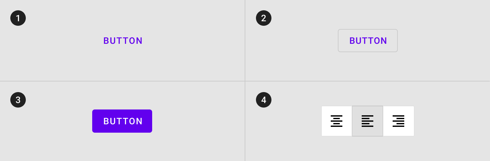

<!--docs:
title: "Buttons"
layout: detail
section: components
excerpt: "Material design buttons allow users to take actions, and make choices, with a single tap."
iconId: button
path: /catalog/buttons/
api_doc_root: true
-->

<!-- This file was auto-generated using ./scripts/generate_readme_new Buttons -->

# Buttons


[Buttons](https://material.io/components/buttons/) allow users to take actions, and make choices, with a single tap.

There are four types of buttons:

1. [Text button](#text-button)
2. [Outlined button](#outlined-button)
3. [Contained button](#contained-button)
4. [Toggle button](#toggle-button) (*not supported in iOS*)



<!--    
 -->


- - -

## Using Buttons

If you're just getting started using Material Components iOS, consider visiting our library's [readme](https://github.com/material-components/material-components-ios).

<!-- Extracted from docs/../../../docs/component-installation-new.md -->

### Installing Buttons

Material Components iOS is currently only available throgh Cocoapods.

#### Cocoapods

Add the following to your `Podfile`:

```bash
pod 'MaterialComponents/Buttons'
```
<!--{: .code-renderer.code-renderer--install }-->

Then, run the following command:

```bash
pod install
```

To import the component:

<!--<div class="material-code-render" markdown="1">-->
##### Swift
```swift
import MaterialComponents.MaterialButtons
```

##### Objective-C

```objc
#import "MaterialButtons.h"
```
<!--</div>-->

<!-- Extracted from docs/accessibility.md -->

### Making Buttons accessible

To help ensure your buttons are accessible to as many users as possible, please
be sure to review the following recommendations:

#### Set `-accessibilityLabel`

Set an appropriate
[`accessibilityLabel`](https://developer.apple.com/documentation/uikit/uiaccessibilityelement/1619577-accessibilitylabel)
value if your button does not have a title. This is often the case with Floating
Action Button instances which typically only have an icon.

##### Objective-C

```objc
button.accessibilityLabel = @"Create";
```

##### Swift

```swift
button.accessibilityLabel = "Create"
```

#### Minimum touch size

Make sure that your buttons have a minimum touch area. The Material spec
for buttons calls for buttons that have a [visual height of
36](https://material.io/design/components/buttons.html#specs)
and that [touch areas should be at least 44 points high and 44
wide](https://material.io/design/layout/spacing-methods.html#touch-click-targets).

#### Set the touch size

To keep a button's visual sizes small with larger touchable areas, set the
`hitAreaInsets` to a negative value. Be careful to maintain sufficient distance
between the button touch targets. This will allow your button to have [a large
enough touch
target](https://material.io/design/layout/spacing-methods.html#touch-click-targets)
while maintaining the desired visual appearance. For more see the [Touch and click
targets](https://material.io/design/layout/spacing-methods.html#touch-click-targets)
in the spec.

##### Objective-C

```objc
CGFloat verticalInset = MIN(0, -(48 - CGRectGetHeight(button.bounds)) / 2);
CGFloat horizontalInset = MIN(0, -(48 - CGRectGetWidth(button.bounds)) / 2);
button.hitAreaInsets = UIEdgeInsetsMake(verticalInset, horizontalInset, verticalInset, horizontalInset);
```

##### Swift

```swift
let buttonVerticalInset =
min(0, -(kMinimumAccessibleButtonSize.height - button.bounds.height) / 2);
let buttonHorizontalInset =
min(0, -(kMinimumAccessibleButtonSize.width - button.bounds.width) / 2);
button.hitAreaInsets =
UIEdgeInsetsMake(buttonVerticalInset, buttonHorizontalInset,
buttonVerticalInset, buttonHorizontalInset);
```

#### Set the minimum visual size of the button

Set your buttons to have a minimum size. [Material Buttons
guidelines](https://material.io/design/components/buttons.html#specs)
typically recommend [a minimum height of 36 points and a minimum width of 64
points](https://material.io/design/components/buttons.html#specs).

##### Objective-C

```objc
button.minimumSize = CGSizeMake(64, 36);
```

##### Swift

```swift
button.minimumSize = CGSize(width: 64, height: 48)
```

#### Exceptions

However there are
[some](https://material.io/design/components/buttons.html#toggle-button) clear
[exceptions](https://material.io/design/components/app-bars-bottom.html#specs)
for these rules. Please adjust your buttons sizes accordingly.

#### Using `accessibilityHint`

Apple rarely recommends using the `accessibilityHint` because the label should
already be clear enough to indicate what will happen. Before you consider
setting an `-accessibilityHint` consider if you need it or if the rest of your
UI could be adjusted to make it more contextually clear.

A well-crafted, thoughtful user interface can remove the need for
`accessibilityHint` in most situations. Examples for a selection dialog to
choose one or more days of the week for a repeating calendar event:

- (Good) The dialog includes a header above the list of days reading, "Event
repeats weekly on the following day(s)." The list items do not need
`accessibilityHint` values.
- (Bad) The dialog has no header above the list of days. Each list item
(representing a day of the week) has the `accessibilityHint` value, "Toggles
this day."


## Text button
<!-- Extracted from docs/text-button.md -->


[Text buttons](https://material.io/components/buttons/#text-button) are typically used for less-pronounced actions, including those located in dialogs and cards. In cards, text buttons help maintain an emphasis on card content.

### Text button example

Text buttons are implemented by [MDCButton](https://material.io/develop/ios/components/buttons/api-docs/Classes/MDCButton.html). To use a text button use the text button theming method on the MDCButton theming extension. For more information on theming extensions see the [Theming section](#theming). 

<!--<div class="material-code-render" markdown="1">-->
#### Swift
```swift
button.applyTextTheme(withScheme: containerScheme)
```

#### Objective-C

```objc
[self.button applyTextThemeWithScheme:self.containerScheme];
```
<!--</div>-->

### Anatomy and Key properties

A text button has a text label and an optional icon.


A. Text label<br>
B. Container (Text buttons do not have containers.)<br>
C. Icon<br>

<details>
<summary>Text button attributes</summary>
<br>

|  | Attribute | Related method(s) | Default value |
| --- | --- | --- | --- |
| **Text label** | <a href="https://developer.apple.com/documentation/uikit/uibutton/1623992-titlelabel"><code>titleLabel</code></a> | <a href="https://developer.apple.com/documentation/uikit/uibutton/1624018-settitle"><code>setTitle:forState:</code></a> <a href="https://developer.apple.com/documentation/uikit/uibutton/1624022-title"><code>titleForState:</code></a> | A system value |
| **Icon** | <a href="https://developer.apple.com/documentation/uikit/uibutton/1624033-imageview"><code>imageView</code></a> | <a href="https://developer.apple.com/documentation/uikit/uibutton/1623997-setimage"><code>setImage:forState:</code></a> <a href="https://developer.apple.com/documentation/uikit/uibutton/1624026-image"><code>imageForState:</code></a> | <code>nil</code> |


</details>

We recommend using [Material Theming](https://material.io/components/\Buttons/#theming) to apply your customizations across your application. For a full list of component properties, go to the API docs.


## Outlined button
<!-- Extracted from docs/outlined-button.md -->


[Outlined buttons](https://material.io/components/buttons/#outlined-button) are medium-emphasis buttons. They contain actions that are important, but aren’t the primary action in an app.

### Outlined button example

Outlined buttons are implemented by [MDCButton](https://material.io/develop/ios/components/buttons/api-docs/Classes/MDCButton.html). To achieve an outlined button use the outlined button theming method on the MDCButton theming extension. To access the theming extension see the [Theming section](#theming). 

<!--<div class="material-code-render" markdown="1">-->
#### Swift
```swift
button.applyOutlinedTheme(withScheme: containerScheme)
```

#### Objective-C

```objc
[self.button applyOutlinedThemeWithScheme:self.containerScheme];
```
<!--</div>-->

### Anatomy and Key properties

An outlined button has a text label, a container, and an optional icon.


A. Text label<br>
B. Container<br>
C. Icon<br>

<details>
<summary>Outlined button attributes</summary>
<br>

|  | Attribute | Related method(s) | Default value |
| --- | --- | --- | --- |
| **Text label** | <a href="https://developer.apple.com/documentation/uikit/uibutton/1623992-titlelabel"><code>titleLabel</code></a> | <a href="https://developer.apple.com/documentation/uikit/uibutton/1624018-settitle"><code>setTitle:forState:</code></a> <a href="https://developer.apple.com/documentation/uikit/uibutton/1624022-title"><code>titleForState:</code></a> | A system value |
| **Container** |  | <a href="https://material.io/develop/ios/components/buttons/api-docs/Classes/MDCButton.html#/c:objc(cs)MDCButton(im)setBorderColor:forState:"><code>setBorderColor:forState:</code></a> <a href="https://material.io/develop/ios/components/buttons/api-docs/Classes/MDCButton.html#/c:objc(cs)MDCButton(im)borderColorForState:"><code>borderColorForState:</code></a> | On surface color at 12% opacity |
| |  | <a href="https://material.io/develop/ios/components/buttons/api-docs/Classes/MDCButton.html#/c:objc(cs)MDCButton(im)setBorderWidth:forState:"><code>setBorderWidth:forState:</code></a> <a href="https://material.io/develop/ios/components/buttons/api-docs/Classes/MDCButton.html#/c:objc(cs)MDCButton(im)borderWidthForState:"><code>borderWidthForState:</code></a> | 1 |
| **Icon** | <a href="https://developer.apple.com/documentation/uikit/uibutton/1624033-imageview"><code>imageView</code></a> | <a href="https://developer.apple.com/documentation/uikit/uibutton/1623997-setimage"><code>setImage:forState:</code></a> <a href="https://developer.apple.com/documentation/uikit/uibutton/1624026-image"><code>imageForState:</code></a> | <code>nil</code> |

</details>

We recommend using [Material Theming](https://material.io/components/\Buttons/#theming) to apply your customizations across your application. For a full list of component properties, go to the API docs:"
List the links to each API


## Contained button
<!-- Extracted from docs/contained-button.md -->


[Contained buttons](https://material.io/components/buttons/#contained-button) are high-emphasis, distinguished by their use of elevation and fill. They contain actions that are primary to your app.

### Contained button example

Contained buttons are implemented by [MDCButton](https://material.io/develop/ios/components/buttons/api-docs/Classes/MDCButton.html). To achieve a contained button use the contained button theming method on the MDCButton theming extension. To access the theming extension see the [Theming section](#theming). 

<!--<div class="material-code-render" markdown="1">-->
#### Swift
```swift
button.applyContainedTheme(withScheme: containerScheme)
```

#### Objective-C

```objc
[self.button applyContainedThemeWithScheme:self.containerScheme];
```
<!--</div>-->

### Anatomy and Key properties

A contained button has a text label, a container, and an optional icon.


A. Text label<br>
B. Container<br>
C. Icon<br>

<details>
<summary>Contained button attributes</summary>
<br>

|  | Attribute | Related method(s) | Default value |
| --- | --- | --- | --- |
| **Text label** | <a href="https://developer.apple.com/documentation/uikit/uibutton/1623992-titlelabel"><code>titleLabel</code></a> | <a href="https://developer.apple.com/documentation/uikit/uibutton/1624018-settitle"><code>setTitle:forState:</code></a> <a href="https://developer.apple.com/documentation/uikit/uibutton/1624022-title"><code>titleForState:</code></a> | A system value |
| **Container** |  | <a href="https://material.io/develop/ios/components/buttons/api-docs/Classes/MDCButton.html#/c:objc(cs)MDCButton(im)setBackgroundColor:forState:"><code>setBackgroundColor:forState:</code></a> <a href="https://material.io/develop/ios/components/buttons/api-docs/Classes/MDCButton.html#/c:objc(cs)MDCButton(im)backgroundColorForState:"><code>backgroundColorForState:</code></a> | Primary color |
| **Icon** | <a href="https://developer.apple.com/documentation/uikit/uibutton/1624033-imageview"><code>imageView</code></a> | <a href="https://developer.apple.com/documentation/uikit/uibutton/1623997-setimage"><code>setImage:forState:</code></a> <a href="https://developer.apple.com/documentation/uikit/uibutton/1624026-image"><code>imageForState:</code></a> | <code>nil</code> |


</details>

We recommend using [Material Theming](https://material.io/components/\Buttons/#theming) to apply your customizations across your application. For a full list of component properties, go to the API docs:"
List the links to each API


## Toggle button
<!-- Extracted from docs/toggle-button.md -->

There is currently no way to achieve a toggle button on iOS.


## Theming

<!-- Extracted from docs/theming.md -->

You can theme an MDCButton to match a
[Material Design button style](https://material.io/design/components/buttons.html) using theming
extensions. [Learn more about theming extensions](../../docs/theming.md).

### How to theme an MDCButton

To make use of the theming methods shown in the examples above import the theming extensions by doing the following:

<!--<div class="material-code-render" markdown="1">-->
#### Swift
```swift
import MaterialComponents.MaterialButtons
import MaterialComponents.MaterialButtons_Theming

let button = MDCButton()
```

#### Objective-C

```objc
#import <MaterialComponents/MaterialButtons.h>
#import <MaterialComponentsBeta/MaterialButtons+Theming.h>

MDCButton *button = [[MDCButton alloc] init];
```
<!--</div>-->

